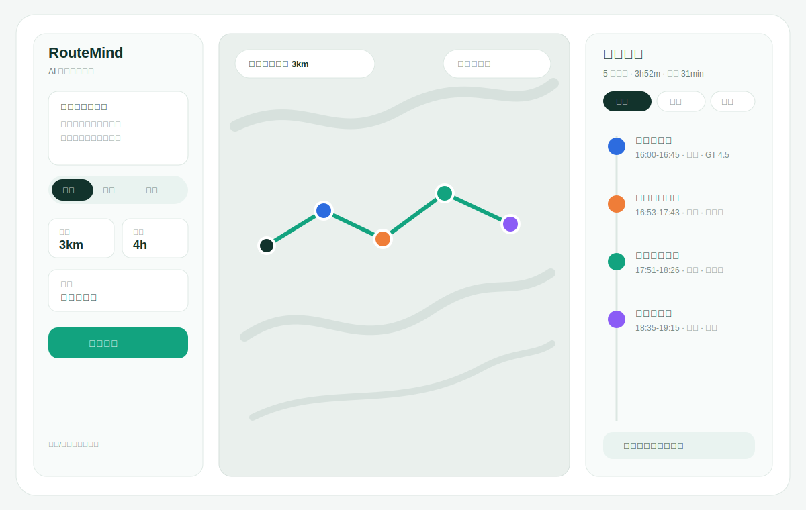
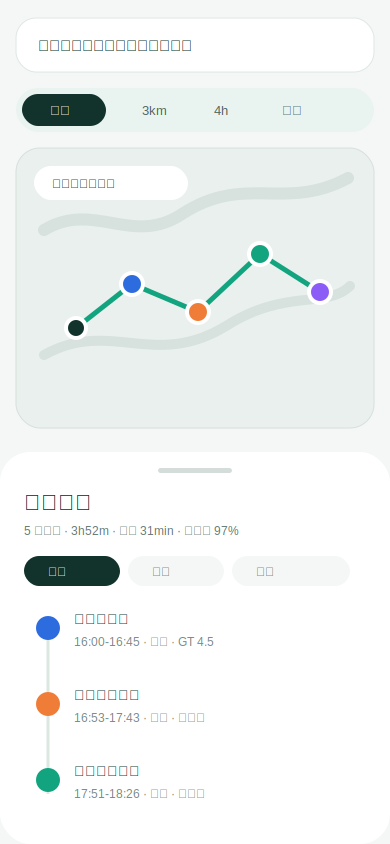

# RouteMind Web UI 草稿

## 1. 项目理解

当前项目是一个覆盖成都武侯区与锦江区的智能路线规划系统。核心能力不是普通 POI 搜索，而是把自然语言目标、用户模式、路网时间、营业时间、评分口碑、类型多样性和会话上下文组合成可执行路线。

网页版已经具备功能骨架：目标输入、会话/用户 ID、三种用户模式、中心点、半径、定位、隐私清除、方案 tabs、Leaflet 地图、时间轴和性能指标。主要 UI 问题是信息仍像表单和结果列表拼接，缺少一眼看懂路线决策的工作台结构。

UI 切入点：从“输入表单页”升级为“城市路线决策台”。用户打开页面后应该立刻看到输入、地图和路线结果的关系，而不是先填一组控件再向下滚动看结果。

## 2. 借鉴参考

- Wanderlog：强调 itinerary 和 map 同屏，适合作为“路线列表 + 地图联动”的参考。https://wanderlog.com/
- Roadtrippers：网页端以地图为主，左侧 itinerary panel 承载途经点、排序和 trip stats。https://support.roadtrippers.com/hc/en-us/articles/203322709-Website-Getting-Started
- Tripadvisor Trips：强调 AI 推荐、协作、保存和组织旅行计划，可借鉴“AI 生成后的可解释结果”表达。https://www.tripadvisor.com/Trips

这些参考的共同点是：地图不能只是结果后的装饰，而应成为规划过程的主要画布；路线时间轴也不只是列表，而是解释为什么这条路线可执行的证据。

## 3. 信息架构草案

桌面端采用三栏工作台：

- 左栏：AI 输入和约束。包含自然语言目标、用户模式 segmented control、半径、预算、位置、出行方式、隐私/会话控制。
- 中栏：地图画布。展示起点、POI 标记、路线折线、分类图例、当前半径和道路级路线说明。
- 右栏：方案与时间轴。展示方案 tabs、总耗时、移动时间、利用率、每站到达/离开/停留/营业/评分，以及“为什么推荐”解释。

移动端采用“输入栏 + 地图预览 + 底部路线抽屉”：

- 顶部保留查询摘要和关键约束。
- 地图占据第一屏上半部分，用户先获得空间感。
- 结果以底部抽屉呈现，路线、地图、解释可用 tabs 切换。

## 4. 页面状态

### 空状态

空状态展示当前位置、服务范围和动态目标建议。右侧显示“输入目标后生成路线”的轻提示，不放大段说明文案。

### 生成中

保留地图和输入面板，右侧显示规划步骤：解析意图、筛选 POI、校验营业、构建路线。按钮进入 loading 状态，避免整页跳动。

### 复杂路线结果

展示 3 个方案：紧凑高效、休闲慢游、美食探店。每个方案都有总耗时、移动时间、POI 数、利用率和推荐理由。点击方案时地图路线、marker 和时间轴同步变化。

### 简单路线结果

只展示 1 个方案，但保留方案容器，把重点放在两个或三个地点之间的顺序、移动成本和营业可行性。

### 单点推荐结果

右侧从时间轴切换为推荐列表，每个卡片展示距离、评分、营业状态、适合原因。地图展示多个候选点，不画完整路线。

### 无结果/可恢复状态

右侧给出具体原因：范围太小、当前时间未营业、单段移动限制过严、地图资源未加载。保留用户可操作的修正入口，如扩大半径、改时间、切换模式。

## 5. 视觉规范草案

- 整体气质：城市工具感，克制、清晰、偏真实可用。
- 背景：`#F4F7F6`，主面板 `#FFFFFF`，浅地图底 `#EAF0ED`。
- 主色：墨绿 `#12332C`，行动色青绿 `#12A37F`。
- 辅助色：蓝色代表景点 `#2D6CDF`，橙色代表餐饮 `#EF7D38`，紫色代表休闲 `#8B5CF6`。
- 圆角：面板 18-24px，按钮和标签 14-22px，路线卡片 16px。
- 字体：系统中文字体栈，避免负字距和随视口缩放字号。
- 地图 marker：起点深色实心圆，POI 使用分类色，白色描边保证在浅底地图上清楚。
- 时间轴：左侧竖线 + 分类色节点，右侧信息分两层，第一层地点名，第二层时间、类型、评分、营业状态。

## 6. 关键交互

- 用户模式用 segmented control，不使用普通下拉。切换模式时约束摘要立即更新。
- 方案 tabs 永远靠近时间轴顶部，点击后地图和路线详情同步。
- “为什么推荐”用折叠区展示：类型命中、距离惩罚低、营业中、路线顺路、模式权重。
- 隐私控制低调放在左栏底部，文案强调“本次会话”和“可删除轻画像”，不制造焦虑。
- 移动端避免三栏压缩，改成地图优先和底部路线抽屉。

## 7. 静态高保真稿

可打开 `ui/route_planner_concept.html` 查看高保真静态稿。它使用内置示例数据呈现 `/api/plan` 的 `variants`、`route`、`recommendations`、`constraints` 结构，不依赖后端、Leaflet 或 CDN。

## 8. 便利性增强方案

下一轮 UI 可以独立推进一组不涉及底层算法的便利设计：中英文切换、地图缩放/归中/图层、方案对比、复制导出、输入示例、时间轴展开、无结果修正和可访问性状态。详见 `ui/usability_enhancement_plan.md`。

新增原型图：

## 9. 桌面 Web V1

根据确认后的需求，第一版只做桌面 Web，推荐视口 `1440 x 900`。高保真静态稿见 `ui/route_planner_desktop_v1.html`，最终预览图见 `ui/desktop-v1-final-preview.png`，操作指引见 `ui/desktop_v1_usage.md`。

## 10. 桌面 Web V2

根据用户视角继续优化：地图改为插画式城市地图，加入楼宇、公园、树木、花草和 POI 类型图标；按钮减字；增加简单皮肤；增加可跳过的新手指引。高保真静态稿见 `ui/route_planner_desktop_v2.html`，最终预览图见 `ui/desktop-v2-final-preview.png`，操作指引见 `ui/desktop_v2_usage.md`。
