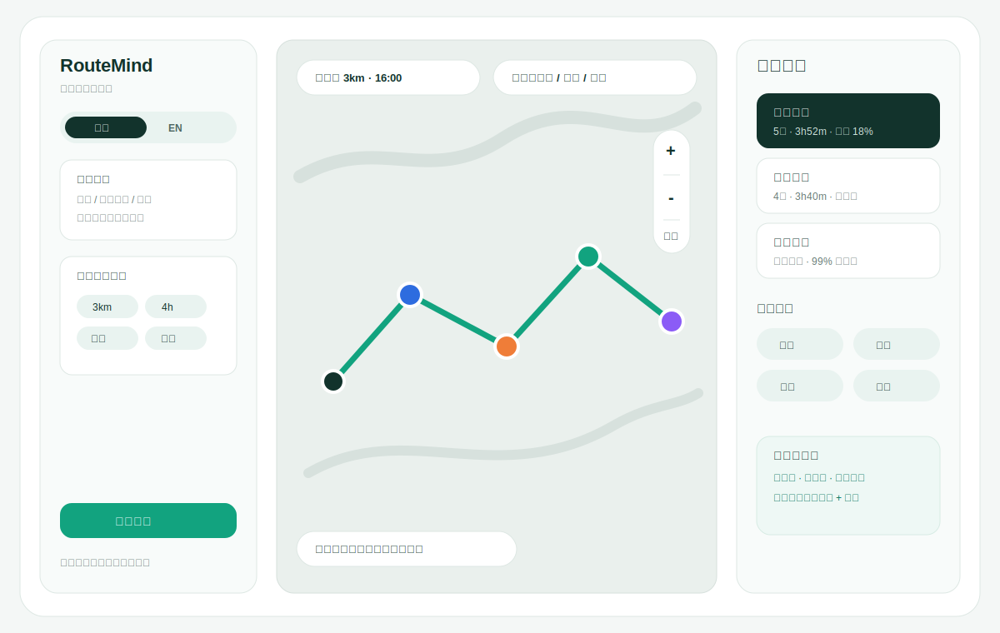
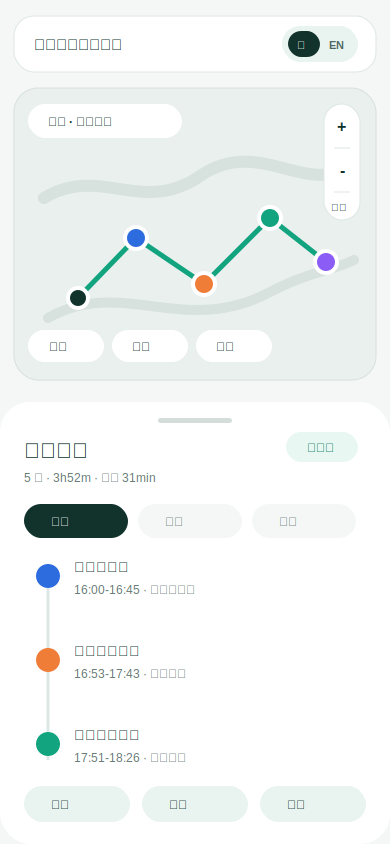

# RouteMind 智行策 Web UI 便利性设计方案

## 1. 目标

本方案只覆盖 UI 层可以独立完成的便利设计，不要求改路线规划算法、数据源或后端接口。重点是让用户更快输入、更稳理解结果、更方便调整和带走路线。

设计原则：

- 不增加学习成本：所有增强都围绕地图、时间轴和结果操作展开。
- 不依赖底层新能力：优先使用现有 `/api/plan` 结果和前端本地状态。
- 不中断主流程：高级设置折叠或放在工具栏，首屏界面保持清爽。
- 可直接交给 Figma：每个能力都拆成组件、状态和交互说明。

## 2. 核心便利功能

### 2.1 中英文切换

适用场景：外籍用户、团队评审、多语言展示。

UI 方案：

- 顶部或左栏品牌区放语言 segmented control：`中文 / EN`。
- 切换只影响前端静态文案、按钮、标签、状态提示和结果字段名，不翻译 POI 原始名称。
- 用户输入框 placeholder 随语言变化。
- 方案名称可映射：紧凑高效 / Efficient、休闲慢游 / Relaxed、美食探店 / Food-first。

Figma 组件：

- `LanguageSwitch / zh`
- `LanguageSwitch / en`
- `TextToken / zh`
- `TextToken / en`

实现不依赖底层：前端维护 `i18n` 字典即可。

### 2.2 地图工具栏

适用场景：用户查看路线空间关系、找附近替代点、回到当前路线。

UI 方案：

- 地图右侧悬浮竖向控件：放大、缩小、回到路线、定位到起点。
- 地图顶部横向控件：路线视图、拥挤视图、营业视图、评分视图。
- 地图底部显示当前视图说明，如“道路级路线 · 3km 搜索半径”。
- marker hover/click 展示简短浮层：地点名、类型、到达时间、营业状态、推荐原因。

Figma 组件：

- `MapControl / zoom-in`
- `MapControl / zoom-out`
- `MapControl / recenter`
- `MapLayerToggle / route`
- `MapLayerToggle / open-now`
- `MapPoiTooltip`

实现不依赖底层：缩放/归中用 Leaflet 已有能力；图层可以先做前端显示开关。

### 2.3 方案对比

适用场景：用户不知道选哪条路线，尤其三方案同时出现时。

UI 方案：

- 方案 tabs 升级为对比卡：总耗时、移动时间、POI 数、利用率、最适合谁。
- 提供“只看差异”开关，突出某方案比另一个少走多少、少几个点、餐饮更多还是休闲更多。
- 移动端用横滑卡片展示方案摘要，点击进入完整时间轴。

Figma 组件：

- `VariantCard / active`
- `VariantCard / inactive`
- `CompareMetric`
- `DiffBadge`

实现不依赖底层：使用现有 `variants` 的统计字段和前端计算差异。

### 2.4 结果带走：复制、导出、分享

适用场景：用户想发给朋友、带到微信、保存到笔记。

UI 方案：

- 右侧结果顶部增加快捷动作：复制路线、导出图片、复制 POI 名单、复制简版文本。
- 分享文本包含：路线名称、总耗时、每站时间、地点名、移动时间。
- 导出图片作为后续增强能力，前端可用 canvas/html-to-image 实现。

Figma 组件：

- `ActionButton / copy`
- `ActionButton / export`
- `ActionButton / share`
- `Toast / success`
- `Toast / error`

实现不依赖底层：复制文本可完全前端生成；导出图是前端渲染能力。

### 2.5 输入便利：示例、历史、本轮清空

适用场景：用户不知道怎么问，或想快速体验产品能力。

UI 方案：

- 输入框下方给 3 个示例 chip：半日游、吃完火锅再逛、出差 1 小时午餐。
- 提供“清空输入”和“使用上次目标”。
- 输入框支持多行对话格式提示，但不展示长说明。
- 检测空输入时，不弹错误，直接把示例 chip 高亮。

Figma 组件：

- `PromptChip`
- `InputAssistant`
- `InlineHint`

实现不依赖底层：示例和本地最近输入可以存在浏览器内存或 localStorage；若隐私优先，可只保留本页面会话。

### 2.6 时间轴微交互

适用场景：用户想理解每一站、替换某站、查看为什么推荐。

UI 方案：

- 时间轴每一站支持展开：推荐原因、营业时间、移动来源、评分解释。
- 每站提供可扩展动作：替换、跳过、复制店名、在地图上定位。
- 替换算法未接入时，按钮进入“正在准备可替换候选”或“重新规划时排除该点”的轻提示。
- 移动端长按站点打开底部操作菜单。

Figma 组件：

- `TimelineStop / collapsed`
- `TimelineStop / expanded`
- `StopActionSheet`
- `ReasonList`

实现不依赖底层：展开、复制、地图定位可前端完成；替换动作需要候选重排接口配合。

### 2.7 反馈与可恢复

适用场景：请求异常、地图资源未加载、无结果、用户误操作。

UI 方案：

- 生成中显示四步进度：解析意图、筛选地点、校验营业、生成路线。
- 无结果给出三个修正按钮：扩大半径、放宽时间、切换模式。
- 地图资源未加载时保留路线时间轴和静态路线示意。
- 所有复制/导出/清除动作都有 toast，不用 alert。

Figma 组件：

- `PlanningProgress`
- `EmptyResult`
- `MapFallback`
- `Toast`

实现不依赖底层：这些都是前端状态包装。

### 2.8 可访问性与键盘操作

适用场景：桌面高频使用、评审现场快速操作。

UI 方案：

- 所有 segmented control 和 tabs 支持键盘 focus。
- 地图工具按钮有 tooltip 和 aria-label。
- 颜色不作为唯一信息，marker 同时带数字和类型。
- 对比指标使用文本标签，不只用图形。

Figma 组件：

- `FocusRing`
- `Tooltip`
- `AccessibleMarker`

实现不依赖底层：前端组件规范即可。

## 3. 原型图

桌面便利工具栏原型：

移动端便利操作原型：

## 4. 推荐优先级

P0，最适合先做：

- 中英文切换
- 地图缩放、归中、图层开关
- 复制路线文本
- 方案对比卡
- 无结果修正按钮

P1，适合 Figma 完成后进入下一轮：

- 导出路线图片
- 时间轴站点展开
- 移动端长按操作菜单
- 输入示例和最近输入
- 地图 POI tooltip

P2，后续接底层或更完整产品时考虑：

- 替换某一站
- 拖拽调整路线顺序
- 多人协作分享
- 实时拥挤热力图

## 5. Figma 交付建议

建议建立 4 个页面：

- `00 Cover`：一句话定位、主视觉截图、色板。
- `01 Desktop Workspace`：主工作台 + 地图工具栏 + 方案对比。
- `02 Mobile Flow`：输入、地图、底部路线抽屉、操作菜单。
- `03 Components`：语言切换、地图按钮、方案卡、时间轴站点、toast、空状态。

建议优先做这些 frame：

- Desktop 1440x900：主规划工作台。
- Desktop 1440x900：方案对比展开态。
- Desktop 1440x900：地图图层菜单打开态。
- Mobile 390x844：结果页底部抽屉。
- Mobile 390x844：站点操作菜单。
- Mobile 390x844：无结果修正态。

## 6. 前端落地边界

不需要后端改动即可落地：

- i18n 文案字典和语言切换。
- 地图缩放、归中、marker tooltip、图层显隐。
- 方案对比卡和前端差异计算。
- 复制路线文本和 toast。
- 输入示例 chip、清空、最近输入。
- 生成中进度包装、无结果修正入口。

需要后续底层配合的能力：

- 真正替换某个 POI。
- 拖拽后重新计算路线。
- 实时拥挤图层真实数据。
- 多人协作和外部分享链接持久化。

## 7. 当前实现状态

已同步到真实 `web/` 前端，而不只是静态 `ui/` 原型：

- 三栏工作台：左侧输入约束、中间地图、右侧方案与时间轴。
- 中英文切换：只切换 UI 文案、字段标签和方案名，不翻译 POI 原始名称。
- 地图工具：放大、缩小、回到路线、定位起点、路线/POI 图层显隐、marker tooltip/popup。
- 方案对比：用真实 `/api/plan` 的 `variants` 统计字段渲染对比卡，并支持“只看差异”。
- 结果带走：复制完整路线文本、复制 POI 名单、toast 反馈；导出图片作为后续增强能力。
- 输入便利：示例 chip、使用本页面会话的上次目标、清空输入、空输入时高亮示例。
- 时间轴微交互：每站展示推荐理由、营业时间、评分、复制店名、地图定位、替换/跳过提示。
- 可恢复状态：生成中四步进度、无结果修正入口、地图资源未加载时保留时间轴。

仍为产品/工程后续项：

- 替换某站、跳过某站后自动重排，需要后端候选重排接口。
- 拖拽调整路线顺序，需要重新计算路线和时间窗。
- 外部分享链接和多人协作，需要持久化分享实体。
- 实时拥挤/营业图层需要稳定的数据服务。
